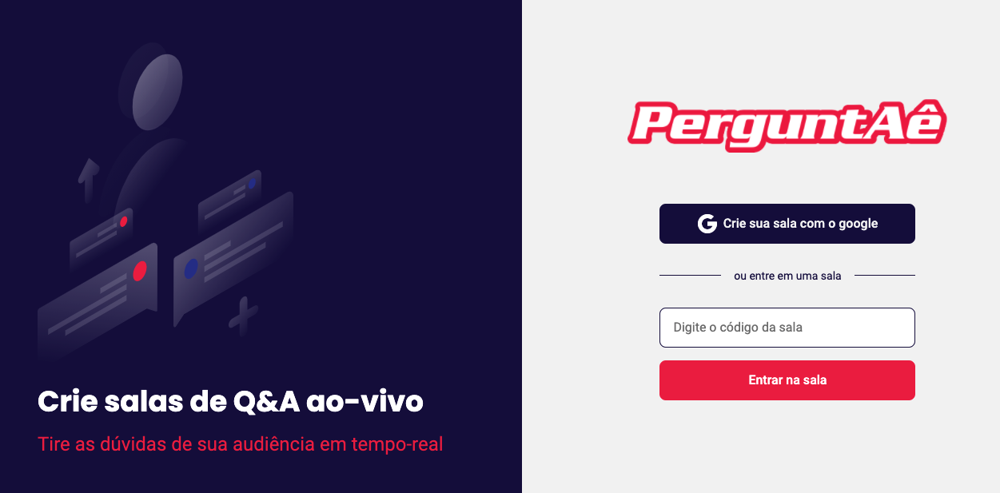

<p align="center">
  
</p>

<p align="center">
  
  
  

     
</p>

<h1 align="center">
    
</h1>

<br>

## 🧪 Technologies

This project was developed using:
- [React](https://reactjs.org)
- [Firebase](https://firebase.google.com/)
- [TypeScript](https://www.typescriptlang.org/)

## 🚀 Running the project

Clone the repository and go into the folder:
```bash
$ git clone https://github.com/bernardojachegou/letmeask_react_rocketseat
$ cd letmeask_react_rocketseat
```

To start:
```bash
# Install the dependencies
$ yarn

# Start the project
$ yarn start
```
It will run into http://localhost:3000.

Remember to create an account into [Firebase](https://firebase.google.com/) and a new project to handle the Realtime Database.

## 💻 Project

PerguntAê is a simple and nice tool that can be used to handle the Q&A in streamming platforms.

This project was created based in **[Next Level Week Together](https://nextlevelweek.com/)**, in July 2021.


---

Thank you Rocketseat 💜 👋🏻 [Rocketseat community](https://discord.gg/gKUVrzrPrU)
